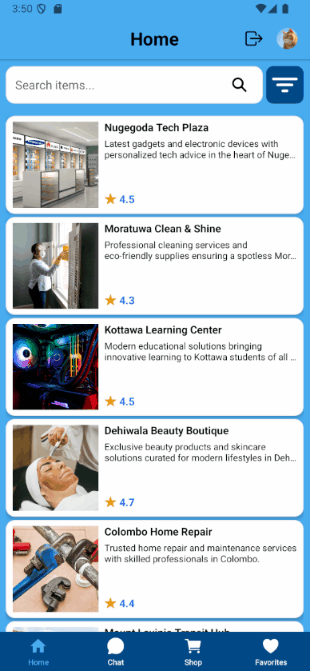
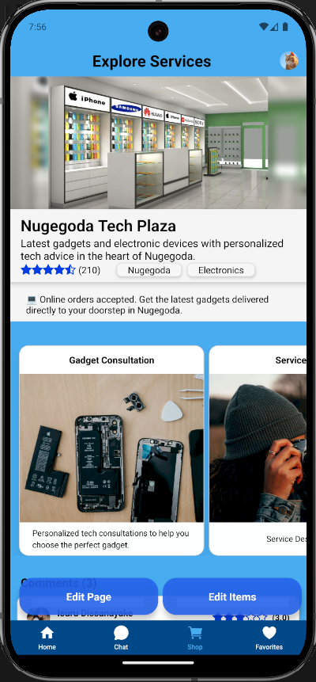
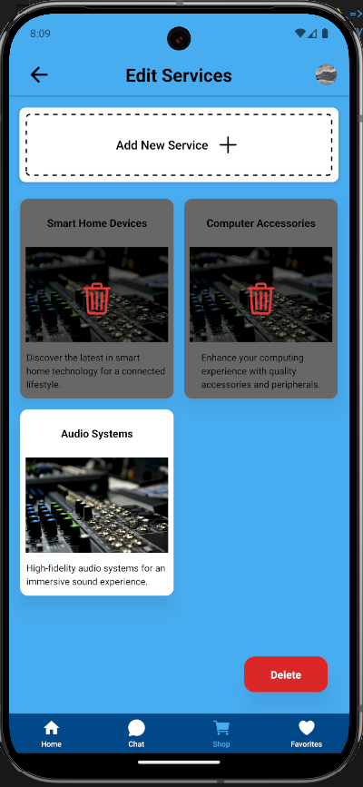
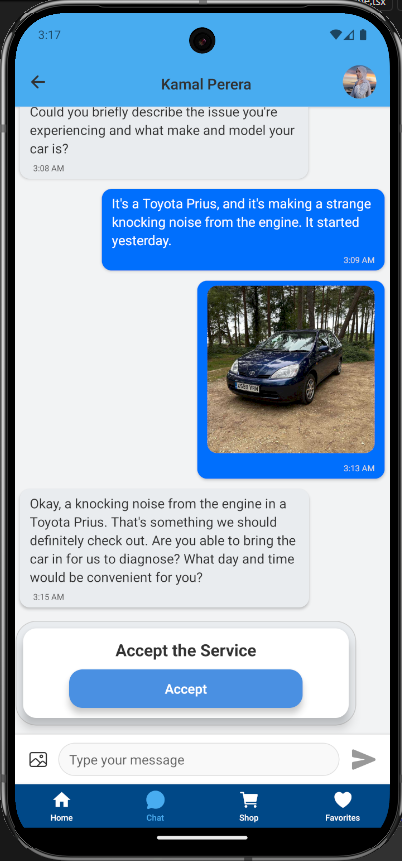
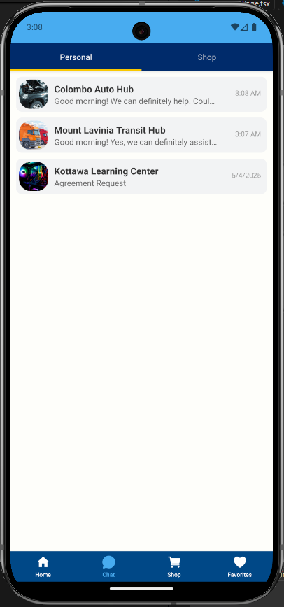

# Service Advertising Mobile App

[](LICENSE)

<p>
  
  
  
</p>

A mobile application built with React Native and Expo, utilizing Firebase as the backend, to connect customers with service providers. Customers can easily find, view, bookmark, chat with, and rate service providers based on their needs. Additionally, any registered user can become a service provider through a simple process.

## Table of Contents

- [Service Advertising Mobile App](#service-advertising-mobile-app)
  - [Table of Contents](#table-of-contents)
  - [Features](#features)
- [](#)
  - [Tech Stack](#tech-stack)
  - [Installation](#installation)

## Features

- **Browse Services:** Users can view a wide range of available services.
- **Search Services:** Feature to search services and also filter services by category or city.
- **Service Details:** Detailed view of each service, including shop info, descriptions, images, service info, and provider contact information.
- **Bookmark Services:** Users can save their favorite service providers for easy access.
- **Real-time Chat:** Integrated chat functionality allowing customers to communicate directly with service providers and make agreements.
- **Rating and Reviews:** Customers can rate and leave reviews for service providers based on their experience.
- **User Registration & Authentication:** Secure registration and login for both customers and service providers.
- **Service Provider Onboarding:** Easy steps for registered users to become service providers and list their services.
- **Shop Modifications:** User-friendly way to modify a user's Shop page.

#

<table>
  Home page 
  <tr>
    <td></td>
    <td></td>
  </tr>
</table>

<table>
  Shop page 
  <tr>
    <td></td>
    <td></td>
  </tr>
</table>

<table>
  Chat Features 
  <tr>
    <td></td>
    <td></td> 
  </tr>
</table>

## Tech Stack

- **React Native:** A framework for building native mobile apps using JavaScript and React.
- **Expo:** A framework and a platform for universal React applications.
- **Firebase:**
  - **Authentication:** For user registration and login.
  - **Firestore:** As the NoSQL cloud database to store service information, user data, and chat messages.
- **Cloudinary:** For storing images.

## Installation

1.  **Prerequisites:**

    - [Node.js](https://nodejs.org/) (version >= 18 recommended)
    - [npm](https://www.npmjs.com/) or [Yarn](https://yarnpkg.com/) package manager
    - [Expo CLI](https://docs.expo.dev/get-started/installation/) (`npm install -g expo-cli`)
    - A Firebase project (Web App type) set up in the [Firebase Console](https://console.firebase.google.com/) with Authentication and Firestore enabled.
    - An Expo Free/Paid Account.

2.  **Clone the repository:**

    ```bash
    git clone https://github.com/dananjaya2002/react-native-service-providing-app.git
    cd react-native-service-providing-app
    ```

3.  **Install Packages:**

    ```bash
    npm install
    ```

4.  **Environment Setup:**

    Create a `.env` file in the root directory with the following structure:

    ```
    # Firebase Configuration
    FIREBASE_API_KEY=<Your Firebase API Key>
    FIREBASE_AUTH_DOMAIN=<Your Firebase Auth Domain>
    FIREBASE_PROJECT_ID=<Your Firebase Project ID>
    FIREBASE_STORAGE_BUCKET=<Your Firebase Storage Bucket>
    FIREBASE_MESSAGING_SENDER_ID=<Your Firebase Messaging Sender ID>
    FIREBASE_APP_ID=<Your Firebase App ID>
    FIREBASE_MEASUREMENT_ID=<Your Firebase Measurement ID>

    # Cloudinary Configuration
    CLOUDINARY_CLOUD_NAME=<Your Cloudinary Cloud Name>
    CLOUDINARY_UPLOAD_PRESET=<Your Cloudinary Upload Preset>
    ```

    You can find these values in your Firebase project settings and Cloudinary dashboard.

5.  **Start the development server:**

    ```bash
    npx expo start
    # or
    yarn start
    ```

    This will open the Expo Developer Tools in your terminal, from where you can run the app on an emulator/simulator or a physical device using the Expo Developer mod app or Expo Go app.

**Recommend: Building a Developer Build**

For accessing certain native features or for potentially better performance during development on a physical device, you might consider building a developer build. Refer to the Expo documentation for instructions:

[https://docs.expo.dev/build/setup/](https://docs.expo.dev/build/setup/)

**Note:** To run the app on a Windows PC, you will need an Android emulator installed and configured.

---
